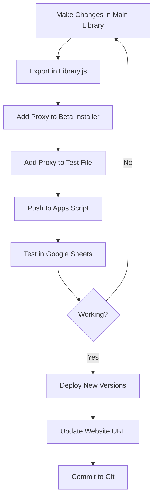

# CellPilot Development Workflow Summary

## 🎯 Key Principle: Keep Everything Synchronized

When developing CellPilot, changes often need to be made in multiple places to maintain consistency.

## 📍 The Four Key Locations

When adding/modifying functions, update ALL of these:

1. **Main Library** (`apps-script/main-library/src/`)
   - The actual implementation
   
2. **Library Export** (`apps-script/main-library/src/Library.js`)
   - Export statement for the function
   
3. **Beta Installer** (`apps-script/beta-installer/Code.gs`)
   - Proxy function for users
   
4. **Test Proxy** (`test-sheet-proxy.js`)
   - Same proxy for testing

## 🔄 Standard Development Flow



## 📝 Step-by-Step Process

### 1. Development Phase
```bash
# Work in main library
cd apps-script/main-library
# Edit src files

# Add exports if new functions
# Edit src/Library.js
```

### 2. Synchronization Phase
```bash
# Add proxies to beta installer
cd ../beta-installer
# Edit Code.gs

# Add to test proxy
cd ../..
# Edit test-sheet-proxy.js
```

### 3. Testing Phase
```bash
# Push changes
cd apps-script
npm run push:library
npm run push:installer

# Test in Google Sheets
```

### 4. Deployment Phase
```bash
# Deploy new versions if needed
cd beta-installer
npx clasp deploy -d "v1.X - Description"

# Update website
cd ../../site
# Edit components/BetaAccessCard.tsx with new URL
```

### 5. Commit Phase
```bash
# Commit everything together
cd ..
git add -A
git commit -m "Feature: Description"
git push
```

## 🛠️ Tools for Each Component

| Component | Tool | Command | Location |
|-----------|------|---------|----------|
| Main Library | clasp | `npm run push:library` | `/apps-script` |
| Beta Installer | clasp | `npm run push:installer` | `/apps-script` |
| Website | git/Vercel | `git push` | `/` |
| Database | Supabase CLI | `npx supabase db push` | `/site` |

## ⚠️ Common Pitfalls to Avoid

1. **Forgetting to export functions** in Library.js
2. **Missing proxy functions** in beta installer or test file
3. **Not updating website URL** after new deployment
4. **Pushing to wrong Apps Script project** (check directory!)
5. **Testing with old version** (hard refresh needed)

## ✅ Pre-Deployment Checklist

Before deploying any changes:

- [ ] All functions exist in 4 places (if user-facing)
- [ ] Run `./scripts/check-sync.sh` to verify
- [ ] Test in actual Google Sheets
- [ ] Deploy new versions if proxies changed
- [ ] Update BetaAccessCard.tsx with new URL
- [ ] Commit all changes together

## 🚀 Quick Commands

```bash
# From project root
./scripts/check-sync.sh         # Check synchronization

# From /apps-script
npm run push:library            # Push main library
npm run push:installer          # Push installer

# Deploy new version (from specific folder)
npx clasp deploy -d "Description"

# Quick commit
git add -A && git commit -m "msg" && git push
```

## 📊 Current Architecture

```
User's Google Sheet
        ↓
Beta Installer Code (Proxy)
        ↓
CellPilot Library (Main Code)
        ↓
Google Sheets API
```

The beta installer acts as a thin proxy layer, calling the main library functions. This keeps the source code private while allowing users to access all features.

## 🔍 Verification

Use the sync checker to ensure consistency:
```bash
./scripts/check-sync.sh
```

This will show:
- Function counts in each file
- Missing functions
- Synchronization status

## 💡 Best Practices

1. **Batch related changes** - Don't deploy partial features
2. **Test thoroughly** - Use test-sheet-proxy.js for testing
3. **Document changes** - Use clear commit messages
4. **Version deployments** - Include description in deploy command
5. **Keep sync** - Run check-sync.sh before major deployments

---

Remember: The key to smooth development is maintaining synchronization across all components. When in doubt, check all four locations!